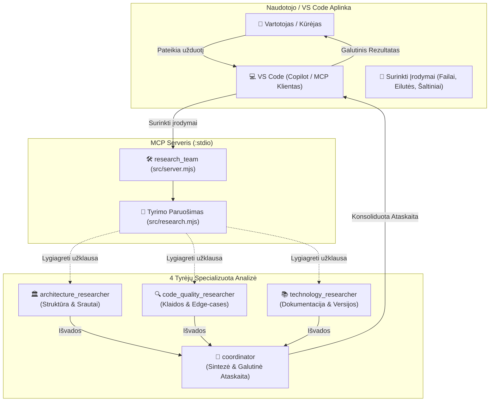

# 🌳 AI Tyrėjų Komanda — Projekto Architektūros Medis

Snapshot data: **2026-09-25**  
Organizacija: [`kibernetinio-saugumo-sprendimai`](https://github.com/kibernetinio-saugumo-sprendimai)  
Repozitorija: [`AI-Tyreju-Komanda`](https://github.com/kibernetinio-saugumo-sprendimai/AI-Tyreju-Komanda.git)

---

## 📁 Pilna Repozitorijos Struktūra

```text
AI-Tyreju-Komanda/
├── 📄 .gitignore                   # Git ignoruojami failai (node_modules, logai, laikini failai)
├── 📄 MCP_SERVER.md                # 🔌 Išsamus vietinio MCP serverio diegimo ir konfigūravimo gidas
├── 📄 README.md                    # 📖 Pagrindinė komandos koncepcija, darbo eiga ir įrodymų taisyklės
├── 📄 TREE.md                      # 🌲 Šis projekto katalogų ir failų medis
├── 📄 UZDUOTIS.md                  # 🎯 Tyrimo užduoties šablonas (klausimas, apimtis, įrodymai, apribojimai)
├── 📄 VAIDMENYS.md                 # 👥 Išsamus 4 tyrėjų atsakomybių, tikslų ir ribų aprašymas
├── 📄 package-lock.json            # 🔒 Užrakintos npm paketų versijos
├── 📄 package.json                 # 📦 Node.js projekto konfigūracija (@modelcontextprotocol/sdk, zod)
├── 📄 vscode-mcp.example.json      # 📄 Pavyzdinė globalios VS Code MCP sąrankos konfigūracija
│
├── 📂 .github/                     # 🤖 AI Agentų Rolės & Instrukcijos
│   ├── 📄 copilot-instructions.md  # 🧠 Globalios GitHub Copilot bendradarbiavimo taisyklės
│   └── 📂 agents/                  # Specializuoti agentų profiliniai nurodymai (VS Code / Copilot)
│       ├── 📄 architecture.agent.md # 🏛️ Architektūros tyrėjas (moduliai, duomenų srautai, priklausomybės)
│       ├── 📄 code-quality.agent.md # 🔍 Kodo kokybės tyrėjas (logikos klaidos, kraštutiniai atvejai, testai)
│       ├── 📄 coordinator.agent.md  # 👑 Koordinatorius (apimties nustatymas, sintezė, galutinė ataskaita)
│       └── 📄 technology.agent.md  # 📚 Technologijų tyrėjas (versijų suderinamumas, oficiali dokumentacija)
│
├── 📂 .vscode/                     # 💻 Lokali VS Code Konfigūracija
│   └── 📄 mcp.json                 # 🔌 Lokali VS Code MCP serverio konfigūracija šiam projektui
│
├── 📂 scripts/                     # 🛠️ Automatizavimo Skriptai
│   └── 📄 install-vscode.mjs       # ⚡ Automatizuotas MCP serverio įrašymas į VS Code naudotojo nustatymus
│
├── 📂 src/                         # ⚙️ MCP Serverio Branduolys
│   ├── 📄 research.mjs             # 🧩 Tyrimo logikos modulis (Zod schemos, rolių įkėlimas, sampling vykdymas)
│   └── 📄 server.mjs               # 🚀 MCP Serverio įeities taškas (list_researchers, prepare_research, research_team)
│
└── 📂 test/                        # 🧪 Automatizuoti Testai
    └── 📄 server.test.mjs          # 🧪 MCP serverio metodų, Zod schemų ir įrankių integracinis testas
```

---

## 🧩 AI Tyrėjų Komandos Sąveikos Schema



---

## 📊 Komandos Vaidmenų Suvestinė

- **Architektūros tyrėjas (`architecture_researcher`):** Sistemos struktūra, modulių atsakomybės, duomenų srautai, priklausomybių grafai.
- **Kodo kokybės tyrėjas (`code_quality_researcher`):** Logikos klaidos, kraštutiniai atvejai, klaidų apdorojimas, testavimo spragos.
- **Technologijų tyrėjas (`technology_researcher`):** Oficiali dokumentacija, versijų suderinamumas, bibliotekų alternatyvų analizė.
- **Koordinatorius & Recenzentas (`coordinator`):** Apimties apibrėžimas, užduočių paskirstymas, prieštaravimų sprendimas, galutinė sintezė.
- **MCP Serveris (`src/server.mjs`):** Standartizuotas Model Context Protocol serveris darbui per VS Code Copilot su sampling palaikymu.
